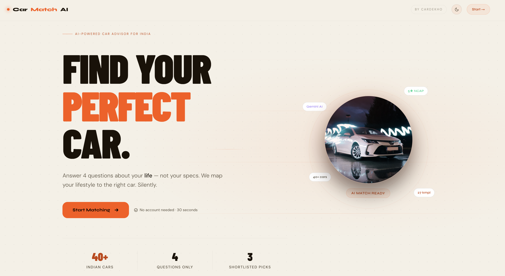
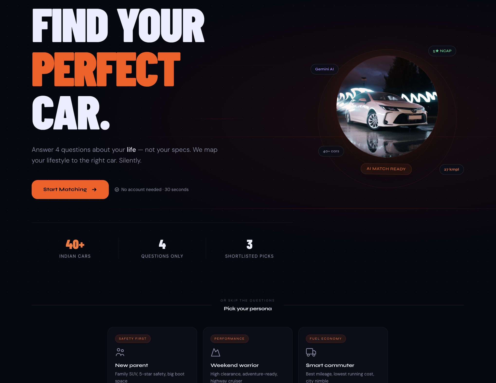
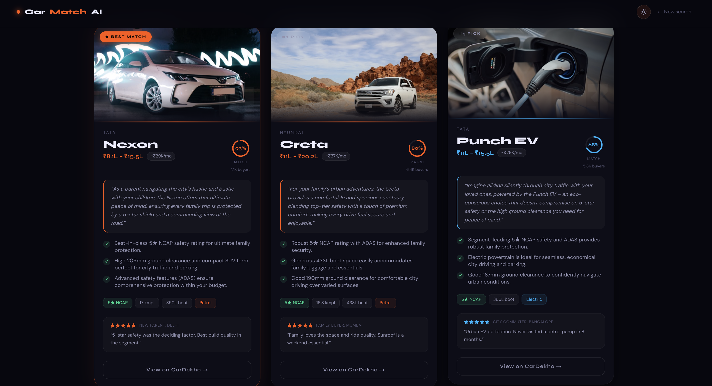
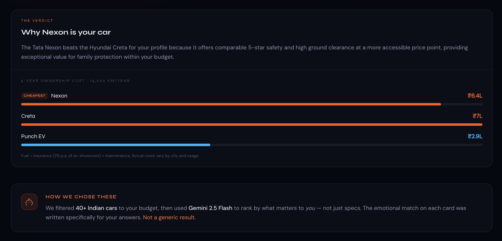

# CarMatch AI — CarDekho Advisor Demo

> Portfolio-grade car advisor that maps your lifestyle to the right car. No spec questions, no paid AI API calls, no visitor cost.

**Live:** https://cardekho-ai-advisor.vercel.app  
**GitHub:** https://github.com/SKYDARTIST/cardekho-ai-advisor  


---

## Screenshots

| Landing — Light | Landing — Dark |
|---|---|
|  |  |

| Results — Car Cards | Results — The Verdict |
|---|---|
|  |  |

---

## What I Built and Why

Most car-buying tools ask "what fuel type do you want?" or "how many cc engine?" — questions buyers can't answer without already knowing cars. The result: decision paralysis, filter overwhelm, abandoned sessions.

**The insight:** confused buyers shop with their hearts, not calculators. So instead of asking spec questions, I ask lifestyle questions. The demo scorer maps lifestyle → specs silently. The buyer feels understood, not interrogated.

### Core Flow

```
Landing → 4-question wizard → demo shortlist (3 cars) → Verdict → "View on CarDekho"
```

**The 4 questions:**
1. What does your typical drive look like? — city / highway / both
2. Who's usually riding with you? — solo / family / couple / pets
3. How do you want to feel behind the wheel? — safe / sharp / smart / arrived
4. What's your hard budget limit? — 4 tiers from under ₹8L to above ₹25L

**Results page:**
- 3 ranked car cards, each with a real car photo and fuel-type themed background
- Personalised **emotional hook** generated from local buyer answers and car data
- 2–3 factual match reasons with checkmarks
- **Match score ring** (0–100%) per card — deterministic scorer ranks how well each car fits this specific buyer
- **EMI estimate** — auto-calculated from priceMax at 80% loan, 8.5% p.a., 60 months
- **Buyer count** — social proof showing how many buyers with a similar profile chose this car
- Spec tags: NCAP rating, mileage, boot space, fuel type
- Featured user review with star rating per car
- **The Verdict** — one sentence explaining why #1 beats #2 for this buyer, plus a 5-year ownership cost comparison across all 3 results
- Demo reasoning strip — transparency on how the shortlist was generated without paid API calls

**Supporting features:**
- Quick Start personas (New parent / Weekend warrior / Smart commuter) — skip the wizard, land directly on results
- Light/dark theme toggle — warm cream palette in light mode, no generic white
- Full-screen editorial loading state with step-by-step progress indicators

---

## What I Deliberately Cut

| Feature | Why |
|---|---|
| User auth / login | Would've killed conversion at entry — the entire problem I'm solving is reducing friction |
| Real-time inventory / pricing | Static data is accurate enough for a demo; live feed needs API keys, rate limiting, caching |
| Saved shortlists | Requires auth + database migrations — not worth the scope |
| Comparison tables | A comparison table re-introduces the paralysis I was removing. One clear verdict beats a grid |
| 20-question spec form | 4 emotional questions produce better results than 20 spec questions. First version had 6 — cut to 4 |
| CNG/EV-only filters | Budget + vibe already routes buyers to the right fuel type naturally |

Every cut protected the core flow. Adding auth would've killed conversion at the entry point. A comparison table would've paralysed the buyer again — exactly the problem I was solving.

---

## Tech Stack

| Layer | Choice | Why |
|---|---|---|
| Framework | Next.js 16 App Router | Single repo for UI + API routes, zero-config Vercel deploy |
| Language | TypeScript | End-to-end type safety from wizard input to API response |
| Styling | Tailwind v4 + CSS custom properties | PostCSS-only approach, no config file; CSS vars handle dark/light theming cleanly |
| Recommendation engine | Local TypeScript scorer | No API key, no paid inference, deterministic portfolio demo |
| Data | Static `data/cars.json` (40 cars) | No DB needed — eliminates setup overhead, sufficient for a shortlisting demo |
| Deploy | Vercel | One push, env vars via dashboard, instant preview URLs |
| Tests | Vitest | Covers the recommendation behavior that drives the product |

**Fonts:** Barlow Condensed (editorial hero numbers) · Syne (headings, UI labels) · DM Sans (body)

---

## How Recommendations Work

This repo used to call Gemini from the server route. It now runs in no-cost demo mode so public visitors cannot spend API credits.

**Current flow:**

1. Code performs a hard budget filter on the 40-car dataset
2. `lib/recommendations.ts` scores cars using the buyer's 4 answers and a vibe-to-spec mapping:
   - `safe` → prioritise 5-star NCAP, ground clearance, safety features
   - `sharp` → prioritise turbocharged engines, sporty variants, driver engagement
   - `smart` → prioritise highest mileage, hybrid/EV options, lowest running cost
   - `arrived` → prioritise brand prestige, sunroof, premium audio, tech features
3. The API returns ranked results with: match score, emotional hook, match reasons, and a head-to-head explanation of why #1 beats #2 for this buyer
4. The UI renders the same product experience without `GEMINI_API_KEY`

The emotional hook is still the differentiator. A generic tool returns a list. This one returns a sentence that makes the shortlist feel personal, while staying transparent and free to run.

---

## What I Delegated to AI vs. Did Manually

### Where AI accelerated execution
- **Initial prompt architecture** — helped shape the original ranking schema before the repo moved to no-cost demo mode
- **CSS variable theming system** — dark/light without React context using CustomEvents is a non-obvious pattern; AI got it right first try
- **SVG icon components** — replacing every emoji with inline SVG across the entire UI; tedious to write manually, AI generated them cleanly
- **Review content at scale** — 2 verified-style buyer quotes across all 40 cars

### Where I made the product decisions
- The lifestyle-over-specs framing — asking "how do you want to feel" instead of "what engine"
- Cutting auth, DB, and comparison features to protect the core flow
- The warm cream light mode (not generic white)
- The Verdict section concept — the gap between "this matches" and "I want this"
- Vibe-to-spec mapping logic that drives recommendation ranking
- Deciding to cap at 3 results instead of a scrollable list

### Where AI got in the way

**Live LLM output was not deterministic enough for a public portfolio demo.** It could hallucinate car IDs or vary the shortlist between runs. The current local scorer only returns cars from `data/cars.json`.

**AI-generated user reviews were uniformly positive and vague.** "Great car, very happy!" reads like fake reviews instantly. Had to manually rewrite several to add credible friction — road noise on highways, tight rear legroom, dealer experience friction — so they felt like real buyers, not marketing copy.

---

## API Cost and Security

- No Gemini/OpenAI key is required for normal demo use
- No paid generation API is called by visitors
- In-memory rate limiter: 30 requests / IP / 60 seconds — protects serverless compute on a demo
- Enum validation on all 4 wizard fields before scoring — rejects anything outside known values
- See `SECURITY.md` for files and secrets that should stay out of commits

---

## If I Had Another 4 Hours

1. **Explainable scoring panel** — show price, safety, mileage, and practicality points beside each recommendation.
2. **Share shortlist via URL** — wizard answers are already in query params; just needs an OG image generator so previews look good when shared on WhatsApp.
3. **EMI configurator** — let the buyer adjust loan tenure and down payment on the card. Most decisions happen at EMI level, not sticker price.
4. **CarDekho API integration** — swap the static JSON for live pricing and availability. The architecture is already designed for it; `cars.json` is a stand-in.
5. **Test drive CTA** — the highest-intent action a buyer can take; connect to CarDekho's dealer booking flow.

---

## Running Locally

```bash
git clone https://github.com/SKYDARTIST/cardekho-ai-advisor.git
cd cardekho-ai-advisor
npm install
```

```bash
npm run dev
```

Open [http://localhost:3000](http://localhost:3000).

---

## Project Structure

```
cardekho-ai-advisor/
├── app/
│   ├── page.tsx                 # Landing: hero, QuickStart personas, Wizard modal
│   ├── results/page.tsx         # Results: demo fetch, CarCards, Verdict, reasoning strip
│   ├── api/recommend/route.ts   # POST: rate limit → enum validation → local scorer
│   ├── layout.tsx               # Font loading, metadata
│   └── globals.css              # Tailwind v4, CSS custom properties, light/dark theme vars
├── components/
│   ├── CarCard.tsx              # Result card: photo, score ring, EMI, hook, reasons, review
│   ├── Wizard.tsx               # 4-step wizard orchestrator with auto-advance
│   ├── WizardStep.tsx           # Single question: progress bar + 2×2 option grid
│   ├── QuickStart.tsx           # 3 persona shortcut cards
│   └── ThemeToggle.tsx          # Sun/moon toggle, localStorage persistence
├── hooks/
│   └── useTheme.ts              # Theme state via CustomEvent — no React context needed
├── lib/
│   └── recommendations.ts       # Local demo scorer, vibe mapping, response builder
├── data/
│   └── cars.json                # 40 Indian cars: specs, pricing, reviews, image URLs
├── docs/
│   ├── architecture.md
│   └── recommendation-methodology.md
├── specs/
│   └── 001-demo-recommendation-engine.md
├── tests/
│   └── recommendations.test.ts
└── types/
    └── index.ts                 # WizardAnswers, CarSpec, CarReview, CarRecommendation, RecommendResponse
```

## Quality Checks

```bash
npm run test
npm run build
npm run audit:high
```

`npm run check` runs tests and production build together. CI runs tests, build, and high-severity audit checks on pushes and pull requests.
